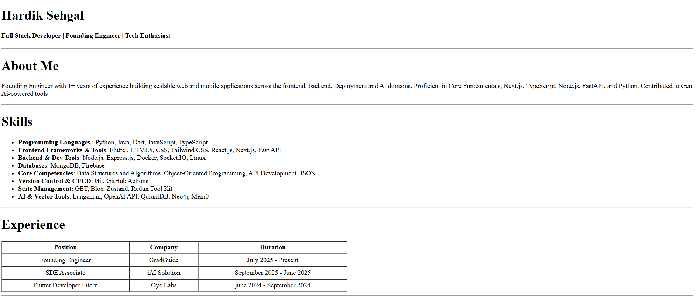
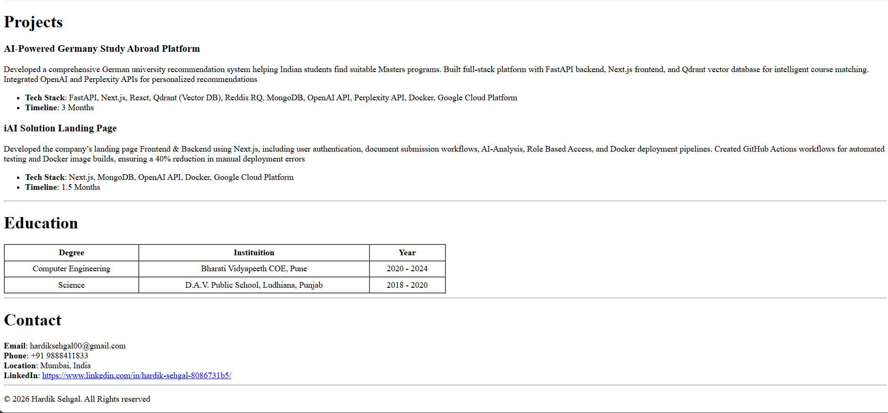

# 📝 HTML Resume Website

A clean and simple static resume website built using pure HTML and deployed using GitHub Pages.

## 🚀 Live Demo

🔗 https://hardiksehgal2.github.io/html_resume/

---

## 📌 Features

- Clean resume layout
- Learned to make table
- Skills section
- Contact information
- Fully responsive basic structure
- Hosted on GitHub Pages

---

## 🛠️ Tech Stack

- HTML5
- Git & GitHub
- GitHub Pages

---

## ⚙️ Setup Instructions

1. Clone the repository

```bash
git clone https://github.com/hardiksehgal2/html_resume.git
```

2. Navigate into the folder

```bash
cd html_resume
```

3. Open `index.html` in your browser

No additional setup required — it's a static website.

---

## 📷 Screenshots

### 🏠 Homepage




---

## 🌍 Deployment

This project is deployed using **GitHub Pages**.

To deploy:

1. Push code to `main` branch
2. Go to GitHub → Settings → Pages
3. Select:
   - Source → Deploy from branch
   - Branch → main
   - Folder → root
4. Save

---

## 📬 Contact

**Email:** hardiksehgal00@gmail.com  
**Location:** Mumbai, India  
**LinkedIn:** https://www.linkedin.com/in/hardik-sehgal-8086731b5/

---
